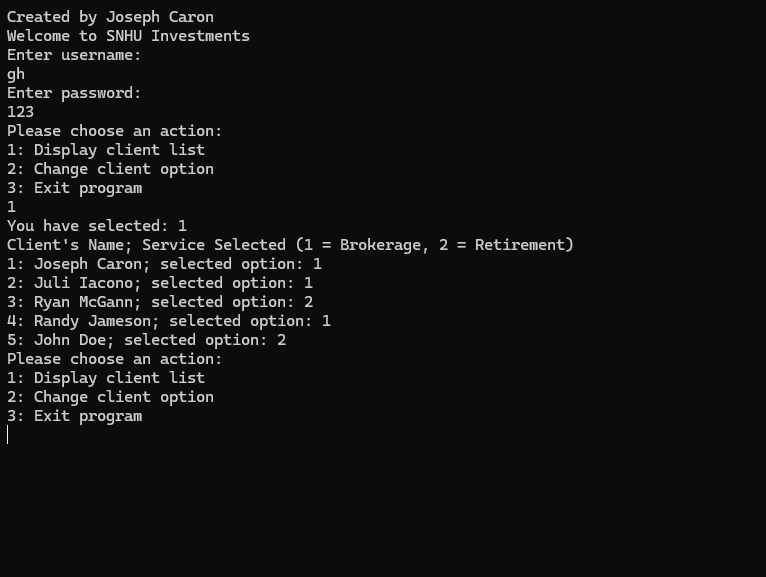
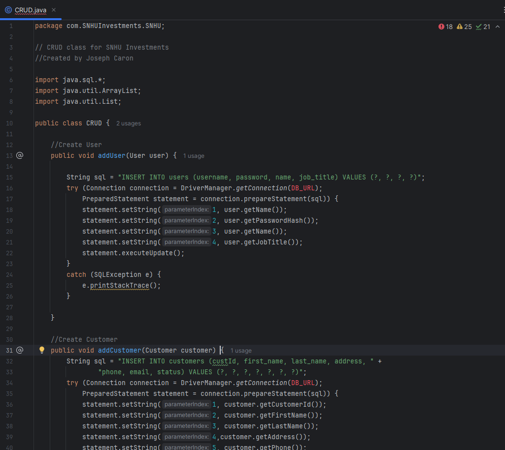
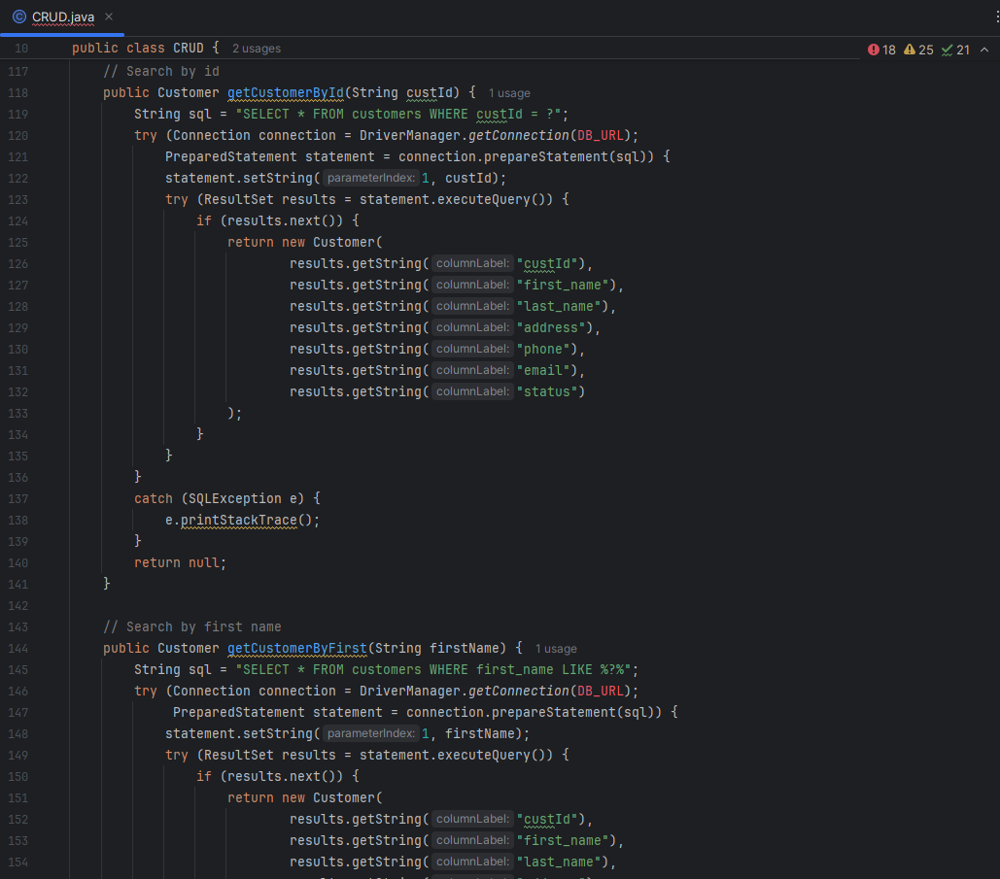

# <pre align="center">Data Structures and Algorithms Enhancements</pre>
This is in the SNHU Enhancement 2 Folder.
This artifact was part of a project for my CS 410: Reverse Software Engineering course. The prompt behind it was a simple client tracking program, and it was mainly to be used just to translate into assembly language, then into binary, and then back to C++. It is a very simple, single class program with a command prompt style text entry interface. I selected this artifact because while the original program was very simple, the idea behind it is a good one. It was also very barebones, which made it a great candidate for enhancement, as it could use a lot of enhancing.

The enhancements completed on this round were adding in a CRUD class that handles all customer database altering methods, as well as a robust search functionality. Now, a user can not only add, modify or delete customer records, they can also search the entire database for customers based on any of the customer attributes: Customer ID, first name, last name, address, phone number or email. I also made good use of the LIKE qualifier in the commands and also set it up to search for partials. If the user only knows part of the customer's email address, for example, they can enter the part they know and get a list of all customers with that portion somewhere in their email. Tweaks to the user interface were also necessary, to make use of the new CRUD functions.

The following course outcomes have been met:
“Design and evaluate computing solutions that solve a given problem using algorithmic principles and computer science practices and standards appropriate to its solution while managing the trade-offs involved in design choices” was met by designing a computing solution to allow for client base and company growth by implementing CRUD methods which allow the client database to be altered and added to, as well as adding users, and by creating a large amount of search algorithms.

“Demonstrate an ability to use well-founded and innovative techniques, skills, and tools in computing practices for the purpose of implementing computer solutions that deliver value and accomplish industry-specific goals” was met by making use of well-founded and innovative techniques, skills and tools to implement the CRUD methods and search algorithms, which delivered much needed value to the program.

### <pre align="center">Future updates</pre>

In the future, I will be performing enhancements for categoory 3, Databases. The updates will include the creation of an embedded SQLite database to hold tables of users and customers. I will also be continuing to make changes to the UI design and tweaks to the existing functionality to allow seamless integration of the new functionality.

### <pre align="center">Original Version</pre>

### <pre align="center">Enhanced Screens</pre>

