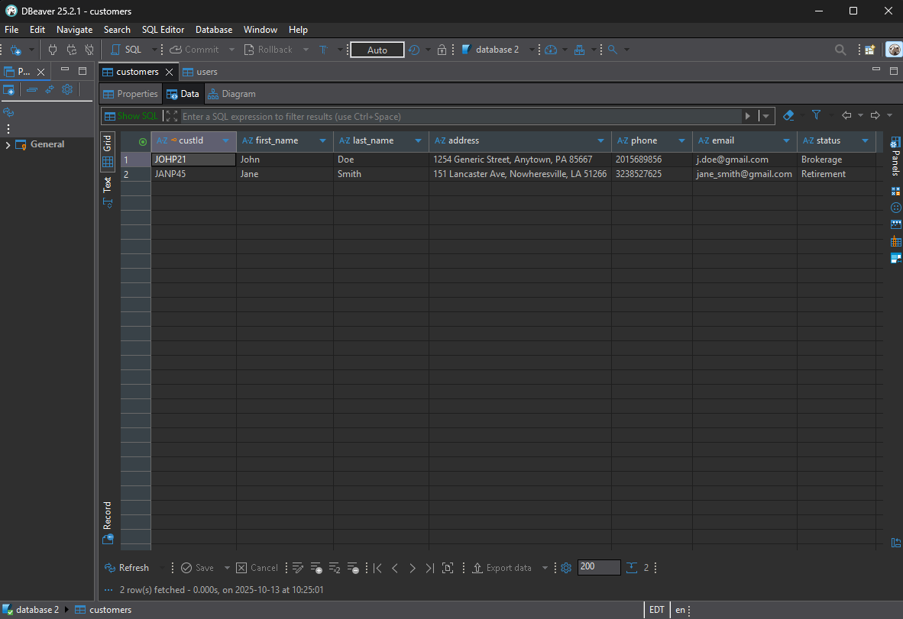

# <pre align="center">SNHU Investments</pre>
This project is the final project for my CS 499 Computer Science Capstone course at SNHU. I chose an artifact from a previous course and made a series of enhancements to it to showcase my skills in three major categories as a computer scientist: Software Design and Engineering, Data Structures and Algorithms, and Databases. The artifact I selected was part of a project for my CS 410: Reverse Software Engineering course. The prompt behind it was a simple client tracking program, and it was mainly to be used just to translate into assembly language, then into binary, and then back to C++. It is a very simple, single class program with a command prompt style text entry interface. I selected this artifact because while the original program was very simple, the idea behind it is a good one. It was also very barebones, which made it a great candidate for enhancement, as it could use a lot of enhancing.

### <pre align="center">Software Design and Engineering</pre>
For the enhancements related to software design and engineering, I ported the code from the original C++ to Java. While Java tends to be a bit slower as it isn't pre-compiled, the trade-off of the platform portability and more secure memory management made more sense. I also added modularity and functionality by splitting the single class program into multiple classes in accordance with object oriented programming, and adding extra functionality such as the ability to add users and customers. I improved security by incorporating password hashing, requiring a unique username to login, and more robust exception handling. Finally, I created a new user interface from scratch to make the program more user friendly for people of all technological backgrounds.

### <pre align="center">Data Structures and Algorithms</pre>
For the enhancements related to data structures and algorithms, I created a CRUD class in the program to handle creation of all users and customers, as well as all customer modification functions and a robust search functionality. This new search function allows users to search for customers using any of the attributes all customers have, such as Customer ID, first name or email address, and allows for partial searches, in case the user only knows part of one of the attributes. Slight tweaks were made to the display class to incorporate these CRUD functions.

### <pre align="center">Databases</pre>
For the databases enhancements, I created a new SQLite database using DBeaver. It has two tables: a user table and a customer table. The user table has columns for username, password hash, name and job title. The usernames must be unique and they are the primary key for the table as well. The only access to this table from the program is by registering a new user. The customer table has columns for the Customer ID, first name, last name, address, phone number, email address and enrollment status. The Customer ID must be unique and the ID serves as the primary key. All columns must be filled. The CRUD functionality has been tied to the database, allowing users to add, search, modify or delete customers from the customer table. Alterations to the user interface for improved user experience have been made such as an output panel at the bottom of the window, as well as some slight changes to layout. Finally, security has also been improved by using prepared statements to guard against SQL injection and better exception logging.

### <pre align="center">Future updates</pre>

In the future, I may choose to continue to make updates to this program for both my own satisfaction as well as because a better portfolio is always helpful for a software engineer. At this time, nothing is planned but that could easily change.

### <pre align="center">Original Version</pre>

### <pre align="center">Enhanced Screens after Software Design and Engineering enhancements</pre>

### <pre align="center">Snippet of code from Data Structures and Algorithms enhancements</pre>

### <pre align="center">Enhanced Screens after Databases enhancements</pre>

