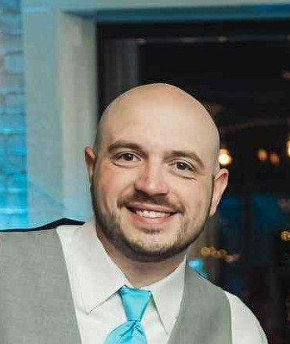

  

# Computer Science Capstone

## CS 499 | SNHU

### About Me
**My name is Joseph Caron. I am currently a student at Southern New Hampshire University about to earn my Bachelor of Science in Computer Science with a concentration in Software Engineering. My goal is to begin a career as a software developer.**

### Code Review
**I created a code review video in order to get a comprehensive look at one of my earlier projects from my college career. I went over the entirety of the code, explaining it’s intended use and faults, as well as going over my planned enhancements.**

**<code>You can watch the video <a href="https://youtu.be/VLXJZ9kP_cU">here</a>.</code>**

**The entirety of this project, three rounds of enhancements on a artifact from a previous course at SNHU, was completed on a single artifact from my CS 410 Reverse Software Engineering course. It was originally designed as a customer tracking program for an investment company, accessed through a text only terminal window, and was vvery minimal.**

#### Project 1: Software Design and Engineering

**This is the first round of enhancements made to the project_1 artifact. I created a new user interface, added functionality, and ported the entire program from C++ to Java. This showcases my ability to code in multiple languages, balance trade-offs with design choices, and add functionality to existing programs.**

  

  
**<code>See the first enhancement report and code <a href="https://github.com/joey-caron/my-eportfolio/tree/Software-Design-and-Engineering">here</a>.</code>**
