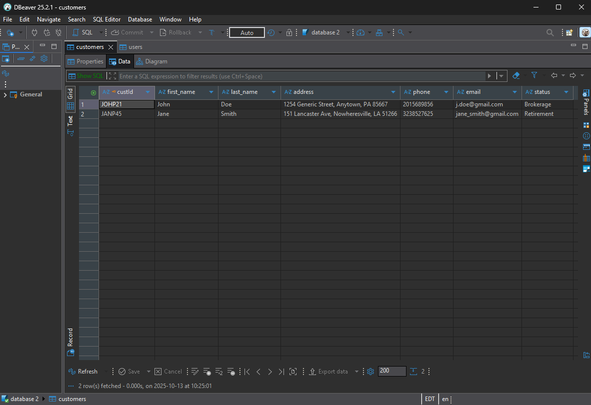

  <kbd></kbd>

# Computer Science Capstone

## CS 499 | SNHU

### About Me
**My name is Joseph Caron. I am currently a student at Southern New Hampshire University about to earn my Bachelor of Science in Computer Science with a concentration in Software Engineering. My goal is to begin a career as a software developer.**

### Professional Self Assessment
**The time I spent in the Computer Science program at Southern New Hampshire University has helped shape my professional goals and values. Prior to my experience at SNHU, I didn’t know much about programming. This means I have less experience, but I also did not develop sloppy habits by teaching myself. When I first entered the program, I intended to become a software developer. Now that I have nearly completed my degree, I truly want to enter the field as a software engineer, possibly even working in DevSecOps.**

	<kbd></kbd>

**This ePortfolio showcases my skills in software engineering, specifically my ability to plan and develop programs. While the work shown in this ePortfolio does not completely reflect all of the work I accomplished throughout the Computer Science program, it does show some of my ability, specifically in the categories of software design and engineering, data structures and algorithms, and databases. Further to what is shown here, I also have developed other skills throughout my time in the computer science program, such as communicating with stakeholders, collaborating in a team environment, and security.**

**Throughout the computer science program at SNHU, I have gained experience collaborating in a team environment by taking part in group discussions and helping my peers with their own projects when needed. In a previous course, I ran into an issue with pushing a commit to github via powershell. I found the root of the issue and was able to get the commit pushed. Shortly after this, one of my peers in the course also ran into the same issue. I was able to explain the solution I had found and she was able to finish her own work. My own personal work experience involves many positions as part of a team, requiring collaboration and teamwork.**

	<kbd></kbd>

**Communicating with stakeholders is another skill I have learned while going through the computer science program. In the SDLC course, I learned about the software development lifecycle and the various roles of team members in an agile scrum team. For part of this course, I had the role of product owner and learned about communicating with stakeholders such as interviewing, taking good notes, and prioritizing the stakeholder needs, which requires a firm understanding of those needs through solid communication. While not exactly the same, I also have a lot of experience working in customer service roles outside of school which could translate into communication with stakeholders.**<kbd></kbd>

**Programming security was another skill that I learned a lot about throughout my schooling. Particularly in my Secure Coding course. I have gained knowledge and skill with looking for gaps in the security of programs, as well as having a security mindset from the start. Finding issues ahead of time such as SQL injection, or not clearing a text entry field on page navigation has become second nature.**

**For the enhancements made in this ePortfolio, I could have chosen three separate artifacts and used a different one for each category. However, the artifact I chose was very simple, and yet had a lot of room for improvement. I also felt that, as I would be making so many functionality changes and even porting from C++ to Java, it was a great option as it would show not only my abilities within the above categories, but also provided the added benefit of being close to a complete program from scratch, treating the original mainly as a guideline.**

**The enhancements made to this artifact show not only my abilities within the mentioned categories, but also show my understanding that all three categories are interconnected. In a previous course, I learned about full-stack development and I think that full-stack is a good way to show how the three categories are interconnected. Design and engineering don’t amount to much if the database isn’t there if its needed. A database does no good without algorithms to access and modify the objects in it. Data structures and algorithms mean nothing without some kind of interconnecting programming allowing users the functionality to do anything with it.**

### Code Review
**I created a code review video in order to get a comprehensive look at one of my earlier projects from my college career. I went over the entirety of the code, explaining it’s intended use and faults, as well as going over my planned enhancements.**

**<code>You can watch the video <a href="https://youtu.be/VLXJZ9kP_cU">here</a>.</code>**

**The entirety of this project, three rounds of enhancements on a artifact from a previous course at SNHU, was completed on a single artifact from my CS 410 Reverse Software Engineering course. It was originally designed as a customer tracking program for an investment company, accessed through a text only terminal window, and was very minimal.**

### Project 1: Software Design and Engineering

**Translating the artifact from C++ to Java showcases my proficiency with multiple programming languages. The original code had some methods to validate integers and strings, methods for logging in, and for updating certain components of clients in the list. This gave me a chance to use object oriented programming principles to make the code more modular by creating new classes. I also had the opportunity to make a much more user friendly interface with text entry fields, dropdown menus and clickable buttons. The security in the original code was worse than poor. Users had to enter a username and password to “log in” to the system, but the username was never checked against anything to make sure it was a good username, and the only password that allowed access was “123”. This gave me a chance to showcase my skill in secure coding by making a more robust log in validation. I’m very pleased to say that I have managed to do all of the above.**

**<code>A full narrative of this round of enhancements can be read <a href="https://github.com/joey-caron/my-eportfolio/blob/Software-Design-and-Engineering/Milestone2-narrative.md">here</a>.</code>**

  <a href="https://github.com/joey-caron/my-eportfolio/tree/Software-Design-and-Engineering" title="View the first enhancement report">
    <kbd></kbd>
  </a>

  
**<code>See the first enhancement report and code <a href="https://github.com/joey-caron/my-eportfolio/tree/Software-Design-and-Engineering">here</a>.</code>**

### Project 2: Data Structures and Algorithms

**This is the second round of enhancements made to the project_1 artifact. This original code had a “list” of customers included in it, but it wasn’t truly a means of storage. Everything except their enrollment status was just an output string that got printed to the screen when prompted. There was no storage of information apart from five variables, one for each “customer”, that each held either a 1 or a 2. There was no ability to actually track customers, nor to add to the list by anyone except someone with access to the source code. There was also no way to search for a specific customer. I was able to showcase my skills and abilities with data structures and algorithms by including a full compliment of CRUD methods, which allow for client base growth, updating client information, removing clients from the database and searching through the entirety of the database using almost any field in the customer table. While a bit minor, the class that handles all of the user interface components also makes use of array lists to handle dropdown menus.**

**<code>A full narrative of this round of enhancements can be read <a href="https://github.com/joey-caron/my-eportfolio/blob/Data-Structures-and-Algorithms/Milestone3-narrative.md">here</a>.</code>**

  <a href="https://github.com/joey-caron/my-eportfolio/tree/Data-Structures-and-Algorithms" title="View the second enhancement report">
    <kbd></kbd>
  </a>

  <a href="https://github.com/joey-caron/my-eportfolio/tree/Data-Structures-and-Algorithms" title="View the second enhancement report">
    <kbd></kbd>
  </a>

**<code>See the second enhancement report and code <a href="https://github.com/joey-caron/my-eportfolio/tree/Data-Structures-and-Algorithms">here</a>.</code>**

### Project 3: Databases

**This round of enhancements was for category three, Databases. So, I created an SQLite database. I chose SQLite because this application doesn’t need a web-based database; just an embedded database is enough. I also chose SQLite over MongoDB, because I wanted the structure of a relational database. However, in terms of company growth, if the SNHU Investments company became larger, it would be wise to switch to a non-embedded database. I would most likely switch to a database made with MySQL, as it is still a relational database and would be easily transferred over, but it would be better for a larger, networked system.**
	
**The database I created in SQLite holds two tables: The first is a table of users, which holds the unique username, which is the primary key for the table, hashed password for security, employee name and job title. The other table is a customer table. It holds the unique Customer ID, which is the primary key, first name, last name, address, phone number, email and account status (brokerage or retirement). For security, I made sure to implement prepared statements to avoid SQL injection, and I made sure that after navigating away from any panel in the UI, all text entry fields would be wiped empty.**

**<code>A full narrative of this round of enhancements can be read <a href="https://github.com/joey-caron/my-eportfolio/blob/Databases/Milestone4-narrative.md">here</a>.</code>**

  <a href="https://github.com/joey_caron/my-eportfolio/tree/Databases" title="View the third enhancement report">
    <kbd></kbd>
  </a>

**<code>See the third enhancement report and code <a href="https://github.com/joey_caron/my-eportfolio/tree/Databases">here</a>.</code>**
